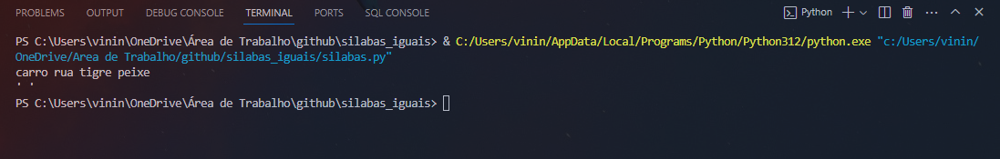
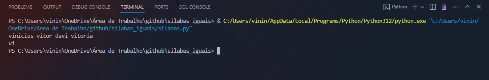
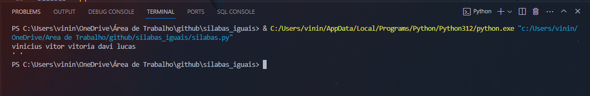

<h1>Silabas_Iguais</h1>

O usuário entrará como um número x de palavras, e a função do programa é retornar a silaba que essas palavras têm em comum, o programa só irá retornar silabas simples, ou seja, Vogal + Consoante: Ba, Be, Bi, Bo, Bu Ca, Ce, Ci, Co, Cu... e assim por diante, caso uma palavra não tenha silabas semelhantes com as outras o programa retornará: ' ' uma string vazia.

O programa só funciona com o dicionário português

<h2>Exemplos</h2>

## Tool

- [Python](https://docs.python.org/pt-br/3/tutorial/)